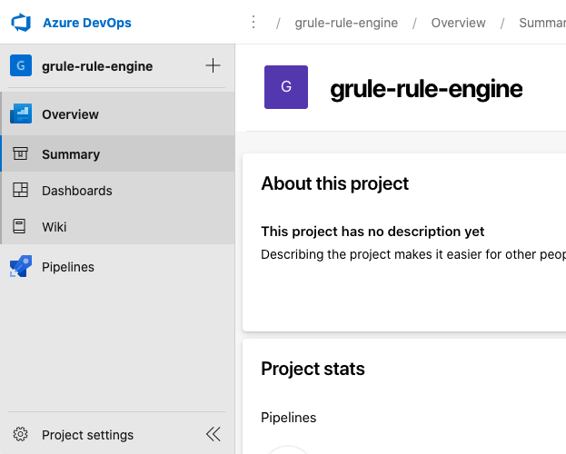
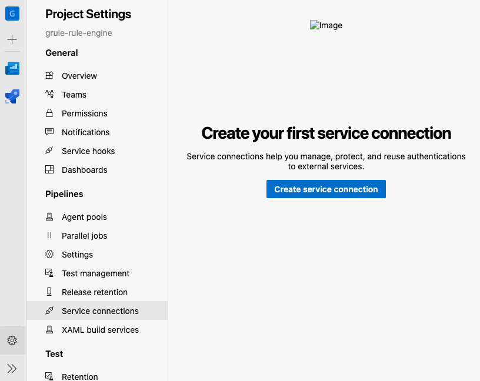
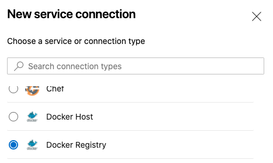
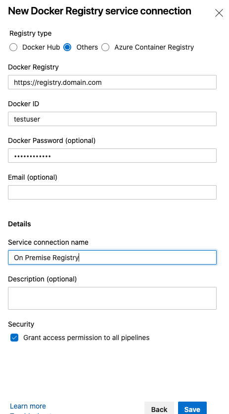
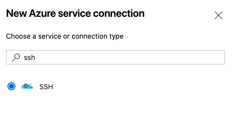

# Azure DevOps CD into On-Premise Docker Swarm Cluster

This documentation explain about how to setup a production environment using Docker Swarm. Docker Swarm is still widely used architecture choosen by many corporates. Other PaaS platform such as Kubernetes are definitely better compared to Docker Swarm but Kubernete's advanced capability also comes with it's own complexity to setup and to maintain.

For companies already have their own on-premise infrastructure containings many services and not yet ready to move to PaaS on the cloud using Kubernetes, Docker Swarm will definitely an option and could become a stepping stone should they ready to move to the cloud.

Further more, we also cover Continuous Deployment using Azure DevOps into a production environment running Docker Swarm Cluster.

## Topology

First, for the entire documentation, we going to have a sample topology of our deployment scenario. You can always adjust this to fit your current situation.

The diagram bellow shows our server and service formations.


Please note that we assume that all host machines are running Ubuntu Linux.

### I. Docker Swarm Cluster

We going to setup multiple machine to form our docker swarm cluster. In this example we have total 23 hosts for the cluster, each of these hosts are assigned with static IPs. This hosts can be a bare metal (physical) computer, a Virtual machine, Virtual Private server or any kind of machine.

The cluster will have the following composition

- 1 Swarm Manager Master
- 2 Swarm Manager Slave
- 20 Swarm Worker

As you can see, 3 Swarm Manager is the advised production. As specified in this [Raft Consensus](https://docs.docker.com/engine/swarm/raft/), Docker is employing the following consensus : *"Raft tolerates up to (N-1)/2 failures and requires a majority or quorum of (N/2)+1 members to agree on values proposed to the cluster. "*

Thus the fault tolerance is becoming as follow

| Manager nodes | Failures tolerated |
| ------------- | ------------------ |
|    1          |       0            |
|    3          |       1            |
|    5          |       2            |
|    7          |       3            |

Thus if we have 3 Swarm Manager, only 1 of them are allowed to fail for the Manager to still working, This will enable the minimum HA (High-Availability) requirement.

You will also notice that Swarm Manager is operating in a Master-Slave model.

### II. Docker Registry

Docker Registry functions as a storage of docker images. This is the location to put docker images produced by deployment pipeline and also the location where those images were released into docker enabled host (our docker swarm).

There are public docker registry used by corporate around the world. One of the is [docker-hub](https://hub.docker.com/). You can setup your corporate account there and have all image published under the account to be private.

### III. CI / CD

Its a best practice to have an automated CI/CD process for build and deployment process. In this documentation, we use Azure DevOps for CI/CD

### IV. GIT Repository

GIT Repository will contains of the development code for your services.

## Deployment Process

To gain a better understanding on the deployment process, please observe the following diagram.


## Setup Everything

### Network Prerequisite

Within the server farm, its important that every hosts are able to *see* each other. 

All of the hosts must allow incoming connection to the following ports :

- TCP port 2377 for cluster management communications
- TCP and UDP port 7946 for communication among nodes
- UDP port 4789 for overlay network traffic

### Docker Prerequisite

For all host within the server farm, the latest **Docker Engine** should be installed in all of them. The complete manual to install docker in ubuntu can be accessed [here](https://docs.docker.com/engine/install/ubuntu/)

#### 1. Uninstall Old Docker
Please note that your ubuntu host might already have an old docker installed. 

```bash
$ sudo apt-get remove docker docker-engine docker.io containerd runc
```

#### 2. Install Docker Engine

1. Update `apt` and install necessary apt repository

```bash
$ sudo apt-get update

$ sudo apt-get install \
    apt-transport-https \
    ca-certificates \
    curl \
    gnupg-agent \
    software-properties-common

$ curl -fsSL https://download.docker.com/linux/ubuntu/gpg | sudo apt-key add -

$ sudo add-apt-repository \
   "deb [arch=amd64] https://download.docker.com/linux/ubuntu \
   $(lsb_release -cs) \
   stable"

$ sudo apt-get update
```

2. Install Docker Engine

```bash
$ sudo apt-get install docker-ce docker-ce-cli containerd.io
```

3. Test your docker

```bash
$ sudo docker run hello-world
```

Having all of our hosts ready with docker, now lets prepare them one-by-one in correct order as shown in the following diagram.


### I. Configure the Master Swarm Manager

The complete manual on how to create a swarm can read [here](https://docs.docker.com/engine/swarm/swarm-tutorial/create-swarm/)

1. SSH to your Master Swarm Manager

```sh
$ ssh 10.1.1.1
```

2. Advertise the new Swarm and declare this server as the `Master`

```sh
$ sudo docker swarm init --advertise-addr 10.1.1.1
```
The output would looks similar like the following

```sh
$ sudo docker swarm init --advertise-addr 10.1.1.1
Swarm initialized: current node (dxn1zf6l61qsb1josjja83ngz) is now a manager.

To add a worker to this swarm, run the following command:

    docker swarm join \
    --token SWMTKN-1-49nj1cmql0jkz5s954yi3oex3nedyz0fb0xx14ie39trti4wxv-8vxv8rssmk743ojnwacrr2e7c \
    10.1.1.1:2377

To add a manager to this swarm, run 'docker swarm join-token manager' and follow the instructions.
```

*Important* You should take note the instruction to be executed of each of every worker later on.

```sh
$ sudo docker swarm join --token \
    SWMTKN-1-49nj1cmql0jkz5s954yi3oex3nedyz0fb0xx14ie39trti4wxv-8vxv8rssmk743ojnwacrr2e7c \
    10.1.1.1:2377
```

*Important* You should also take note the command to add another manager (slave managers) into the swarm

```sh
$ sudo docker swarm join-token manager
```

3. You can always check the swarm status by invoking `docker info` command and see all swarm nodes by invoking `docker node ls` command.

#### Configure SSH Keys for use by Azure DevOps so it can SSH to this master manager.

1. Create a new user for Azure DevOps

```sh
$ useradd azure
```

2. Switch user as `azure`

```sh
$ sudo su azure
```

3. Create keypair

```sh
$ ssh-keygen -t rsa
```

The output would look something like this

```
$ ssh-keygen -t rsa
Generating public/private rsa key pair.
Enter file in which to save the key (/home/azure/.ssh/id_rsa): 
Enter passphrase (empty for no passphrase): 
Enter same passphrase again: 
Your identification has been saved in /home/azure/.ssh/id_rsa.
Your public key has been saved in /home/azure/.ssh/id_rsa.pub.
The key fingerprint is:
4a:dd:0a:c6:35:4e:3f:ed:27:38:8c:74:44:4d:93:67 azure@a
The key's randomart image is:
+--[ RSA 2048]----+
|          .oo.   |
|         .  o.E  |
|        + .  o   |
|     . = = .     |
|      = S = .    |
|     o + = +     |
|      . o + o .  |
|           . o   |
|                 |
+-----------------+
```

4. Append the public key `/home/azure/.ssh/id_rsa.pub` into the end of `/home/azure/.ssh/authorized_keys`

5. Makesure that `/home/azure/.ssh/authorized_keys` file mode is 600.

```
$ chmod 600 /home/azure/.ssh/authorized_keys
```

**Important** Copy the private key `/home/azure/.ssh/id_rsa` to your local and store it safely. You will use this key later to configure azure devops so it can SSH to the server.

### II. Configure the Slave Swarm Managers

1. SSH to your 1st Slave Swarm Manager

```sh
$ ssh 10.1.1.2
```

2. Add new Manager to the previously created swarm

```sh
$ sudo docker swarm join-token manager
```

Follow the instruction on screen.

3. Repeat again #1 and #2 for the 2nd Slave Swarm Manager

### III. Configure the Swarm Workers

The complete manual on how to add node to a swarm can be read [here](https://docs.docker.com/engine/swarm/swarm-tutorial/add-nodes/)

For every each one of the host for Swarm Worker, `10.1.1.10` to `10.1.1.29` repeat all the following steps.

1. SSH to your 1st Swarm Worker

```sh
$ ssh 10.1.1.10
```

2. Execute the command advised from the previous `docker swarm init` when you crete the swarm in the previous "Configure the Master Swarm Manager" step.

```sh
$ sudo docker swarm join --token \
    SWMTKN-1-49nj1cmql0jkz5s954yi3oex3nedyz0fb0xx14ie39trti4wxv-8vxv8rssmk743ojnwacrr2e7c \
    10.1.1.1:2377
```

The output should be simillar to the following

```sh
$ sudo docker swarm join --token \
    SWMTKN-1-49nj1cmql0jkz5s954yi3oex3nedyz0fb0xx14ie39trti4wxv-8vxv8rssmk743ojnwacrr2e7c \
    10.1.1.1:2377

This node joined a swarm as a worker.
```

3. Repeat #1 and #2 above for every host for Swarm Worker (`10.1.1.10` to `10.1.1.29`).

### IV. Configure the Docker Registry

The complete manual on how to prepare a docker registry can be read [here](https://docs.docker.com/registry/deploying/)

**Prerequisite**

1. We going to assume that this registry will be accessible from the internet at `https://registry.domain.com`
2. The host, 10.1.1.30:443 have their routing and firewall reachable from the internet through the domain above.
3. You have your own **VALID** SSL certificate (namely `domain.crt` and `domain.key` files). All these files are located on the host in `/cert` folder. Please also ensure that the `domain.crt` are a fully `chained` certificate (if your CA do not provide you with one).

You can chain your certificate using the following command

```sh
cat /certs/domain.crt /certs/intermediate-certificates.pem > /certs/domain-chained.crt
```

4. You have to have an access list in form of a `htpasswd` file located in `/auth` folder. This will provide a basic and native way for user-password authentication to your registry.

First. Stop the registry if its already started.

```sh
$ sudo docker container stop registry
```

Second. Create the `/auth` folder

```sh
$sudo mkdir /auth
```

Third. Create the user.

```sh
$ sudo docker run \
  --entrypoint htpasswd \
  registry:2 -Bbn testuser testpassword > /auth/htpasswd
```

Fourth. Stop the registry again.

```sh
$ sudo docker container stop registry
```

From here you should have a directory `/auth` containing `htpasswd` file.

```sh
$ cat /auth/htpasswd
testuser:$2y$05$8IpPEG94/u.gX4Hn9zDU3.6vru2rHJSehPEZfD1yyxHu.ABc2QhSa
```

**Deploying**

1. SSH to your Docker Registry Host

```sh
$ ssh 10.1.1.30
```

2. Prepare a folder where you will store all of the images (possibly mounted from an NFS)

```sh
$ sudo mkdir -p /mnt/registry
$ sudo mount 10.1.2.3:/var/nfs/registry /mnt/registry
```

2. Deploy the registry image

```sh
$ docker run -d \
        -p 443:443 \
        --restart=always \
        --name registry \
        --v /certs:/certs \
        --v /auth:/auth \
        --v /mnt/registry:/var/lib/registry \
        -e "REGISTRY_AUTH=htpasswd" \
        -e "REGISTRY_AUTH_HTPASSWD_REALM=Registry Realm" \
        -e REGISTRY_AUTH_HTPASSWD_PATH=/auth/htpasswd \
        -e REGISTRY_HTTP_ADDR=0.0.0.0:443 \
        -e REGISTRY_HTTP_TLS_CERTIFICATE=/certs/domain.crt \
        -e REGISTRY_HTTP_TLS_KEY=/certs/domain.key \
        registry:2
```

### V. Configure the Firewall

#### 1. Enabling Azure DevOps to push new image to our Docker Registry using SSL on port 443.

The docker registry are configured to accept `https` connection on port 443. Thus we simply
add port forwarding in the firewall to forward incoming to port 443 to the Registry (10.1.1.30).

Add routing on the fire wall similar to the following iptables instruction.

```
iptables -t nat -A PREROUTING -p tcp -d 10.1.1.30 --dport 443 -j DNAT --to-destination 10.1.1.30:443
```

#### 2. Enabling Azure DevOps to ssh the Master Swarm Manager for updating services.

Azure DevOps will try to SSH to Master Swarm Manager for invoking `docker service update` command.
Thus we simply add port forwarding in the firewall to forward incoming to 22 to the Manager (10.1.1.1).

Add routing on the fire wall similar to the following iptables instruction.

```
iptables -t nat -A PREROUTING -p tcp -d 10.1.1.1 --dport 22 -j DNAT --to-destination 10.1.1.1:22
```

### VI. Configure the Azure DevOps

We need to configure azure to store *secrets* for it to later use when authenticating to docker registry and ssh into the swarm manager master.

#### Service Connection To Docker Registry

1. Login to Azure DevOps and open your project.
2. Open `Project settings`



3. Select `Service Connection` from the `Project Settings` menu.



4. Choose `Docker Registry` option and click `Next`



5. Fill in the `New Docker Registry service connection form`. Specifying all information we have during preparation of the Docker Registry above. When done, click `Save`



Description about each field in the form can be read [Here](https://docs.microsoft.com/en-us/azure/devops/pipelines/library/service-endpoints?view=azure-devops&tabs=yaml#sep-docreg)

**Important !!** Take note of the `Service Connection Name` you just created. You will need to use this name later when configuring the pipeline.

#### Service Connection for SSH to Master Swarm Manager

1. Login to Azure DevOps and open your project.
2. Open `Project settings`


3. Select `Service Connection` from the `Project Settings` menu.


4. Choose `SSH` option and click `Next`



5. Fill in the `New SSH service connection form`. Specifying all information we have during preparation of the SSH of Master Swarm Manager above. When done, click `Save`


- Host Name : Is the hostname to reach Master Swarm Manager (should've configured in DNS and Firewall)
- Port Number : 22
- Private Key : Copy the content of Private Key that you saved during the `Configure SSH Keys for use by Azure DevOps so it can SSH to this master manager` stage above. Or simply upload it.
- Username : azure

Description about each field in the form can be read [Here](https://docs.microsoft.com/en-us/azure/devops/pipelines/library/service-endpoints?view=azure-devops&tabs=yaml#sep-ssh)

**Important !!** Take note of the `Service Connection Name` you just created. You will need to use this name later when configuring the pipeline.

### VII. Configure the Deployment Pipeline

For every project that you want to deploy, we have to create the `azure-pipelines.yml`.

```yaml
trigger:
  tags:
    include:
    - *.GA

  pool:
    vmImage: 'Ubuntu-16.04'

  steps:
  - task: ...
    ...
  - task: ...
    ...
  - task: ...
    ...
# First we login to the Docker Registry
  - task: Docker
    displayName: Login Docker Registry
    inputs:
        command: login
        containerRegistry: RegistryServiceConnection
# Then we built the Docker Image, Tag them and Push into the Registry
  - task: Docker
    displayName: Build and Push
    inputs:
        command: buildAndPush
        repository: service/SomeService
        tags: |
            latest
# Logout from the registry
  - task: Docker
    displayName: Logout Docker Registry
    inputs:
        command: logout
        containerRegistry: RegistryServiceConnection
# Run shell commands or a script on a remote machine using SSH
# This will instruct a service to update it self using the new :latest image.
  - task: SSH@0
    inputs:
       sshEndpoint:  MasterSwarmManagerServiceConnection
       runOptions: commands
       commands: sudo docker service update --image service/SomeService:latest --force service_name
       failOnStdErr: true

```