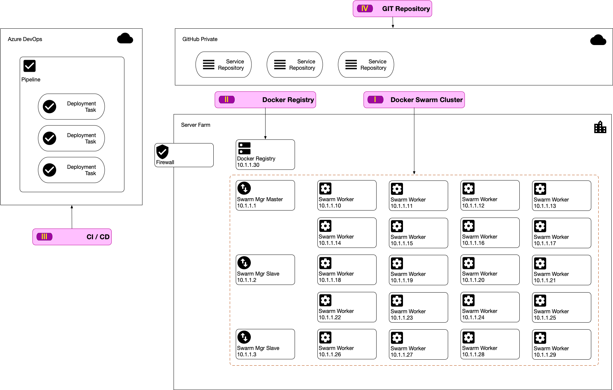

# Azure DevOps CD into On-Premise Docker Swarm Cluster

This documentation explain about how to setup a production environment using Docker Swarm. Docker Swarm is still widely used architecture choosen by many corporates. Other PaaS platform such as Kubernetes are definitely better compared to Docker Swarm but Kubernete's advanced capability also comes with it's own complexity to setup and to maintain.

For companies already have their own on-premise infrastructure containings many services and not yet ready to move to PaaS on the cloud using Kubernetes, Docker Swarm will definitely an option and could become a stepping stone should they ready to move to the cloud.

Further more, we also cover Continuous Deployment using Azure DevOps into a production environment running Docker Swarm Cluster.

## Topology

First, for the entire documentation, we going to have a sample topology of our deployment scenario. You can always adjust this to fit your current situation.

The diagram bellow shows our server and service formations.

### I. Docker Swarm Cluster

We going to setup multiple machine to form our docker swarm cluster. In this example we have total 23 hosts for the cluster. This hosts can be a bare metal (physical) computer, a Virtual machine, Virtual Private server or any kind of machine.

The cluster will have the following composition

- 1 Swarm Manager Master
- 2 Swarm Manager Slave
- 20 Swarm Worker

As you can see, 3 Swarm Manager is the advised production. As specified in this [Raft Consensus](https://docs.docker.com/engine/swarm/raft/), Docker is employing the following consensus : *"Raft tolerates up to (N-1)/2 failures and requires a majority or quorum of (N/2)+1 members to agree on values proposed to the cluster. "*

Thus the fault tolerance is becoming as follow

| Manager nodes | Failures tolerated |
| ------------- | ------------------ |
|    1          |       0            |
|    3          |       1            |
|    5          |       2            |
|    7          |       3            |

Thus if we have 3 Swarm Manager, only 1 of them are allowed to fail for the Manager to still working, This will enable the minimum HA (High-Availability) requirement.

## Deployment Process

## Setup Everything

